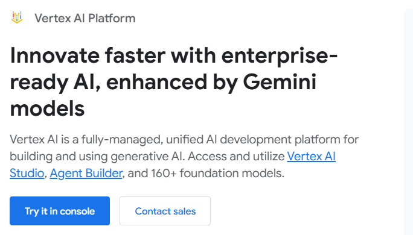
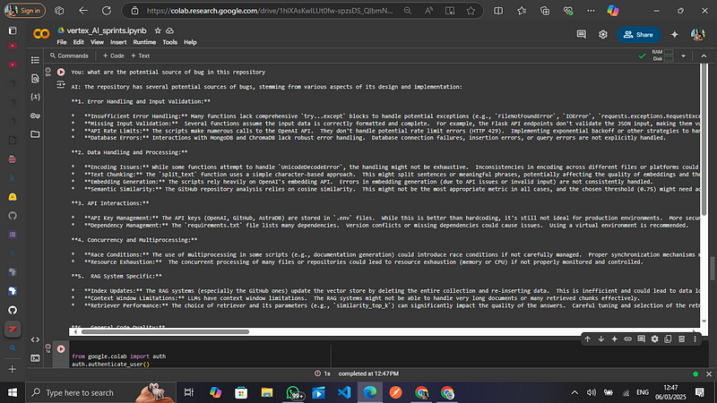

# Building an AI-Powered Workflow Automation Agent on Google Cloud


## Introduction

In today's fast-paced digital landscape, productivity is a key factor in business and development success. Teams often spend countless hours on repetitive tasks such as drafting emails, summarizing research papers, generating visual content, and navigating complex codebases. This is where AI-driven automation comes in.

In this guide, we will build an **AI Workflow Automation Agent** using **Google Cloud's Vertex AI, Gemini, and Imagen API** to handle:

- **Email drafting** using Vertex AI's generative model.
- **Research paper summarization** for quick insights.
- **Visual content generation** using Google's Imagen API.
- **Chat with Codebase** for understanding and improving existing code.
- **Google Drive Integration** for file management automation.

By the end of this tutorial, you’ll have a working AI-powered agent that automates these workflows, improving efficiency and productivity.

---

## Why We Need AI Workflow Automation

1. **Saves Time & Effort**: Automates repetitive tasks, allowing teams to focus on high-impact work.
2. **Improves Accuracy**: AI minimizes errors in document writing and summarization.
3. **Enhances Creativity**: Generates images to complement code documentation.
4. **Boosts Productivity**: Streamlines workflows and speeds up execution.
5. **Better Code Understanding**: AI-assisted code navigation improves debugging and optimization.
6. **Automated File Management**: Google Drive integration enhances document handling efficiency.

---

## Setting Up Google Cloud & APIs

### Step 1: Create a Google Cloud Project

1. Go to [Google Cloud Console](https://console.cloud.google.com/).
2. Click on **Select a Project** > **New Project**.
3. Name your project and note your **Project ID**.

### Step 2: Enable Required APIs

1. Open the **API & Services** dashboard.
2. Enable the following APIs:
   - Vertex AI API
   - Gemini API
   - Imagen API
   - Google Drive API
3. Click **Enable API** for each.

### Step 3: Get API Keys

1. Navigate to **IAM & Admin** > **Service Accounts**.
2. Create a service account and generate a JSON key.
3. Save the key (`service-account.json`) and set up authentication:
   ```bash
   export GOOGLE_APPLICATION_CREDENTIALS="/path/to/service-account.json"
   ```

---

## Building the AI Agent


### Step 1: Install Dependencies

```bash
pip install google-cloud-aiplatform google-auth google-auth-oauthlib google-auth-httplib2 google-auth google-api-python-client requests
```

### Step 2: Initialize Vertex AI

```python
import vertexai
vertexai.init(project="your-gcp-project-id", location="us-central1")
```

### Step 3: Email Drafting Function

```python
from vertexai.language_models import TextGenerationModel

def generate_email_draft(prompt):
    model = TextGenerationModel.from_pretrained("gemini-pro")
    response = model.predict(prompt, temperature=0.7, max_output_tokens=500)
    return response.text
```

### Step 4: Research Paper Summarization

```python
from vertexai.generative_models import GenerativeModel

def summarize_research_paper(text):
    model = GenerativeModel("gemini-pro")
    response = model.generate_content(f"Summarize this research paper: {text}")
    return response.text
```

### Step 5: Image Generation with Imagen API

```python
from vertexai.preview.generative_models import PreviewGenerativeModel

def initialize_imagen_model():
    model = PreviewGenerativeModel("imagegeneration@002")
    return model

def generate_image(prompt: str):
    model = initialize_imagen_model()
    response = model.generate_content(
        prompt,
        generation_config={"response_mime_type": "image/png"}
    )
    image_data = response.candidates[0].content.parts[0].data
    return {"image_data": image_data}
```

### Step 6: Chat with Codebase

```python
from vertexai.language_models import CodeGenerationModel

def chat_with_codebase(code_snippet, query):
    model = CodeGenerationModel.from_pretrained("gemini-code")
    response = model.predict(f"Code: {code_snippet}\nQuery: {query}")
    return response.text
```

### Step 7: Authenticate and Interact with Google Drive

#### Authenticate Google Drive

```python
from googleapiclient.discovery import build
from google.oauth2 import service_account
import os

def authenticate_drive():
    credentials = service_account.Credentials.from_service_account_file(
        os.getenv("GOOGLE_APPLICATION_CREDENTIALS"),
        scopes=["https://www.googleapis.com/auth/drive"]
    )
    drive_service = build('drive', 'v3', credentials=credentials)
    return drive_service
```

#### List Files in Google Drive

```python
def list_drive_files(drive_service, query: str = ""):
    results = drive_service.files().list(q=query, pageSize=10, fields="files(id, name)").execute()
    items = results.get('files', [])
    return {"files": items}
```

#### Example Usage

```python
drive_service = authenticate_drive()
files = list_drive_files(drive_service, query="mimeType='application/pdf'")
```

---

## Conclusion

We successfully built an **AI Workflow Automation Agent** using **Google Cloud's Vertex AI, Gemini, and Imagen API**. This AI agent can:

- **Generate email drafts** to improve communication.
- **Summarize research papers** for quicker insights.
- **Create AI-generated visuals** to enhance presentations and reports.
- **Chat with a codebase** to navigate, debug, and optimize code.
- **Authenticate and manage files in Google Drive** for seamless automation.

### Next Steps

- Deploy the AI agent as a **Google Cloud Function**.
- Create a **Flask API** to serve the functions.
- Integrate with **Google Workspace APIs** for automation in Gmail and Docs.
- Expand the codebase interaction to include refactoring suggestions.

By leveraging Google Cloud AI, we can build smarter workflows that drive efficiency and innovation in modern workplaces.

For access to the full code and implementation details, visit our GitHub or Colab repository:

🔗 GitHub Repository: https://github.com/Victorasuquo/vertex_aI-sprint

🔗 Google Colab Notebook: https://colab.research.google.com/drive/1hlXAsKwILUt0fw-spzsDS_QIbmNZm7yn?usp=sharing

References:

Google Cloud Vertex AI
Google Gemini AI: https://ai.google.dev/
Google Imagen API: https://cloud.google.com/vertex-ai/generative-ai/docs/image/overview

This Project is supported by Google ML Developer Programs as part of my VertexAI sprint

#AI #MachineLearning #VertexAI #GoogleCloud #Automation #AIWorkflow #GenerativeAI #Productivity #CodeAutomation #ImagenAPI #GeminiAI #Python 

